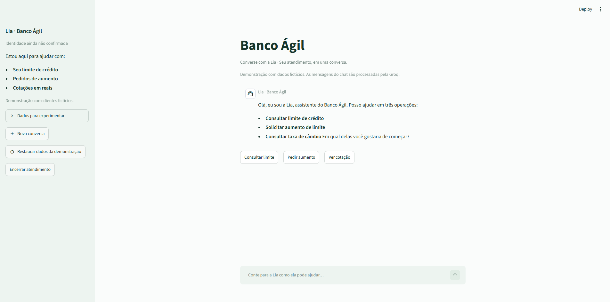
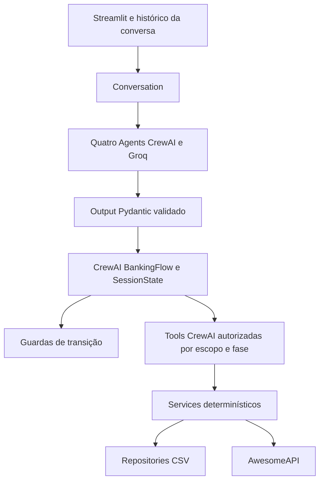

# Banco Ágil

[](https://github.com/Brianrafs/Desafio-T4H/actions/workflows/ci.yml)

## Visão Geral

Atendimento bancário conversacional com quatro especialistas CrewAI, estado explícito e regras financeiras determinísticas. A interface Streamlit reúne autenticação, crédito, entrevista financeira e câmbio em uma conversa contínua.

A assistente se chama **Lia** em todas as etapas. Suas mensagens usam Markdown e respostas curtas, com acolhimento apenas quando o contexto pede. Ao concluir uma operação, ela sugere um próximo passo relacionado em vez de repetir o menu completo. Atalhos no chat continuam disponíveis para consultar limite, pedir aumento ou escolher uma cotação.


### Limitações

- MVP demonstrável com CSVs; não usar como sistema bancário de produção.
- Escritas concorrentes entre sessões não são suportadas.
- O teste automatizado da UI usa integrações simuladas. O teste manual real cobriu os turnos após autenticação local; a coleta de CPF e nascimento pela Groq não foi incluída nesse cenário.
- Não há banco transacional, painel administrativo, tracing distribuído ou autenticação de produção.



## Arquitetura do Sistema



- **Agents:** triagem, crédito, entrevista e câmbio têm responsabilidades, schemas e conjuntos de tools próprios. Não recebem o CPF autenticado no contexto do prompt nem tabelas de decisão financeira.
- **GroqProvider:** usa `BaseLLM` do CrewAI com HTTP via `httpx`, temperatura 0,2 e JSON validado localmente. A API recebe um contrato JSON separado do prompt ReAct do executor. Há no máximo duas chamadas por turno: a inicial e uma repetição por output inválido, geração truncada ou HTTP 400 com `json_validate_failed`. Outros erros HTTP não são repetidos. HTTP 429 recebe a classificação `llm_rate_limited` e uma orientação para aguardar, preservando a sessão.
- **Tools:** as mesmas tools tipadas são vinculadas aos agentes e ao Flow. Na fase de interpretação, executar uma tool é recusado. Após validar o turno, o Flow libera a chamada; a tool delega ao service e verifica novamente sessão, agente e etapa. O modelo não pode fornecer CPF a operações de crédito.
- **Flow:** preserva intenção antes da autenticação, controla a matriz de transições, aceita somente o campo aguardado na entrevista e reanalisa automaticamente o valor anterior. Cada sessão permite uma entrevista concluída; a reanálise encerra o ciclo mesmo quando o pedido continua rejeitado. O Flow não depende de frases exatas do LLM, e respostas operacionais usam resultados determinísticos para exibir valores e decisões.
- **Services:** comparam credenciais, avaliam crédito, calculam score e consultam câmbio. Valores monetários usam `Decimal`.
- **Repositories:** validam os CSVs e escrevem arquivos temporários no mesmo diretório, com `flush`, `fsync` e `os.replace`.
- **Sessão:** autenticação e progresso ficam no `SessionState`; o histórico exibido fica em `st.session_state.messages`. Nenhum dos dois substitui a persistência do domínio.

O retorno `return_to_triage` só é autorizado pelo Flow ao concluir a operação, sem campos pendentes. A primeira rejeição pode aguardar o aceite da entrevista; depois de uma entrevista concluída, a aprovação ou rejeição retorna ao atendimento geral sem novo convite na mesma sessão. A última resposta da Lia acompanha a mensagem atual para dar contexto a respostas curtas; credenciais de turnos anteriores não são reenviadas. O acolhimento fica vazio por padrão e só aparece quando acrescenta contexto; valores, decisões e próximos passos vêm do resultado confirmado pelo Flow.

### Estrutura

```text
app.py                     Interface Streamlit
data/                      CSVs fictícios versionados
docs/plans/                Especificação e plano
src/banco_agil/
  agents/                  Persona e fábrica dos quatro especialistas
  flow/                    Orquestração, guardas e transições
  models/                  Domínio, estado, outputs e erros
  providers/               Integração Groq
  repositories/            Acesso exclusivo a CSVs e inicialização
  services/                Regras determinísticas
  tools/                   Fachada e adapters CrewAI
  bootstrap.py             Composição da aplicação
  conversation.py          Ponte entre interpretação e Flow
  observability.py         Eventos estruturados
tests/                     Unitários, Flow, tools, integrações e UI
```

## Funcionalidades Implementadas

- Autenticação progressiva com CPF e nascimento fictícios; encerramento após três falhas completas.
- Consulta de limite e pedidos de aumento, com aprovação ou rejeição determinística e histórico persistido.
- Entrevista de cinco perguntas após rejeição e aceite explícito, com etapa e barra de progresso dentro da resposta mais recente da Lia, novo score e reanálise automática. Uma entrevista concluída não é oferecida novamente na mesma sessão.
- Cotações de USD, EUR e GBP em reais, com recuperação de falhas transitórias.
- Conversa contínua com Lia, respostas em Markdown e atalhos para novas operações.
- Status **Identidade confirmada** sem CPF e aviso visível de que as mensagens do chat são processadas pela Groq.
- Reinício de sessão e restauração da demonstração com confirmações separadas.
- Ao mudar para câmbio com um pedido de aumento incompleto, Lia explica a interrupção e oferece consultar o limite antes de retomar o pedido, inclusive após falhas de persistência.

## Desafios Enfrentados e Como Foram Resolvidos

### Output estruturado e continuidade

O contrato JSON enviado à Groq foi separado das instruções ReAct do executor. Pydantic valida o retorno; `json_validate_failed`, truncamento ou output inválido permitem somente uma nova tentativa. Outputs de um especialista incompatível registram um código seguro, sem alterar o restante da sessão. Checkpoints preservam dados já confirmados em falhas posteriores.

Handoffs são internos ao Flow. Lia mantém a mesma identidade, usa próximos passos ligados ao resultado e não exige autenticação novamente na mesma sessão. Aceites ambíguos mantêm a confirmação da entrevista pendente.

### Crédito e recuperação de falhas


Um aumento só é aprovado se o valor solicitado superar o limite atual e respeitar o teto da faixa de score. A solicitação nasce `pendente`. Para uma aprovação, o limite do cliente é gravado antes da conclusão do status; somente após ambas as escritas há uma resposta de aprovação.

Como dois CSVs não formam uma transação, pedidos pendentes são reconciliados antes de novas operações de crédito ou alterações de score. Se o cliente ainda tem o limite original, a avaliação é retomada; se já tem o limite solicitado, a aprovação é finalizada. Uma repetição imediata do mesmo pedido recuperado não cria outra linha. Um limite incompatível com ambos bloqueia a operação com erro controlado. Esse mecanismo pressupõe um único escritor e não oferece segurança para sessões concorrentes.

A entrevista persiste o score antes de retornar ao crédito. Se a reanálise falhar por erro técnico, os dados já confirmados e a etapa concluída são mantidos para permitir retomada. Se a reanálise terminar em rejeição, o fluxo volta à triagem e não oferece outra entrevista na mesma sessão; uma recusa anterior, sem entrevista realizada, não consome essa possibilidade.

### Câmbio e privacidade

O serviço aceita USD, EUR e GBP, com timeout de 5 segundos por tentativa. Timeouts, falhas de conexão e HTTP 5xx têm uma única repetição. HTTP 404 e demais 4xx não são repetidos. Payload inválido resulta em indisponibilidade controlada.

Logs JSON registram eventos e `session_id`, sem CPF, nascimento, renda, despesas, dívida, prompts ou segredos. O console detalhado do CrewAI e a coleta de métricas do Streamlit estão desabilitados. Mensagens digitadas são enviadas à Groq para interpretação e permanecem no histórico da sessão da UI; use somente os dados fictícios nesta demonstração.

## Escolhas Técnicas e Justificativas

| Tecnologia | Justificativa |
|---|---|
| CrewAI Agents e Flow | Especialistas para interpretação e estado explícito com guardas para orquestração |
| Groq | Interpretação em linguagem natural com contrato JSON e tentativas limitadas |
| Pydantic e Decimal | Validação tipada e cálculo monetário sem aproximação binária |
| CSV e repositories | Formato exigido no desafio, persistência auditável e escrita atômica por arquivo |
| AwesomeAPI e httpx | Cotações em BRL com timeout e retry controlados |
| Streamlit | Demonstração conversacional e estado por sessão com widgets nativos |
| pytest, AppTest e MockTransport | Verificação offline das regras, falhas externas e interface |
| uv e GitHub Actions | Dependências travadas e os mesmos comandos de qualidade localmente e na CI |

## Tutorial de Execução e Testes

### Requisitos e instalação

- Python 3.13.
- [uv](https://docs.astral.sh/uv/getting-started/installation/).
- Uma chave da Groq para conversar em linguagem natural.

Na raiz do projeto:

```powershell
uv sync --locked
Copy-Item .env.example .env
```

No Linux/macOS, substitua a segunda linha por `cp .env.example .env`.

Preencha `GROQ_API_KEY` no `.env` e execute:

```powershell
uv run streamlit run app.py
```

Acesse o endereço local exibido pelo Streamlit, normalmente `http://localhost:8501`. Sem chave, a interface abre com instruções de configuração e o chat desabilitado. Nunca coloque a chave no código, no chat ou no Git.

### Configuração

| Variável | Padrão | Uso |
|---|---|---|
| `GROQ_API_KEY` | vazio | Credencial necessária para interpretação da conversa |
| `GROQ_MODEL` | `groq/llama-3.3-70b-versatile` | Modelo Groq, configurável conforme disponibilidade da conta |
| `AWESOME_API_KEY` | vazio | Chave opcional, enviada no header `x-api-key` |
| `DATA_DIR` | `runtime/data` | Diretório dos CSVs de trabalho |

`OTEL_SDK_DISABLED=true`, `CREWAI_TELEMETRY_ENABLED=false` e `CREWAI_TRACING_ENABLED=false` são aplicados antes de carregar CrewAI para impedir tracing e telemetria com dados da conversa. Os exemplos de ambiente refletem essa política; ela não é uma opção de ativação de tracing neste MVP.

Na primeira execução, os repositories copiam os dados fictícios de `data/` para `DATA_DIR`. A inicialização valida os três CSVs, incluindo cobertura contínua de score de 0 a 1000. Alterações de limite e score ficam na cópia de trabalho, ignorada pelo Git.

**Nova conversa** pede confirmação e reinicia apenas a sessão. **Restaurar dados da demonstração** pede uma confirmação separada e restaura limites, scores, faixas e solicitações nos três CSVs conhecidos; outros arquivos são preservados. A restauração também inicia uma nova conversa. Cada CSV é escrito atomicamente; o conjunto dos três não forma uma transação. Use somente dados fictícios e mantenha `DATA_DIR` separado de `data/`.

### Testes e qualidade

```powershell
uv run pytest -q --cov=src/banco_agil --cov-report=term-missing --cov-fail-under=85
uv run ruff check src tests app.py
uv run ruff format --check src tests app.py
```

Os testes não precisam de chaves ou internet. Usam CSVs temporários, `httpx.MockTransport`, agentes CrewAI reais em testes de integração e Streamlit `AppTest` para interagir com o chat. Cobrem aprovação, rejeição, entrevista, matriz de guardas, escopos, falhas de escrita, tentativas de injetar campos protegidos e preservação de estado.

Os avisos de depreciação emitidos internamente pelo CrewAI 1.15.22 são mantidos visíveis. As versões resolvidas estão em `uv.lock`.

A suíte automatizada cobre regras de domínio, transições do Flow, autorização das tools, integrações simuladas e a interface Streamlit. O resultado atual é publicado pelo workflow CI, com cobertura mínima de 85% sobre `src/banco_agil`.

### Demonstrações

| Cliente fictício | CPF | Nascimento | Limite inicial | Score inicial |
|---|---|---|---|---|
| Ana | `00000000001` | `15/01/1990` | R$ 1.000,00 | 400 |
| Bruno | `00000000002` | `20/05/1985` | R$ 3.000,00 | 850 |

Os CPFs são identificadores sintéticos de teste. O MVP normaliza pontuação e compara CPF e nascimento com o CSV; não implementa autenticação bancária real.

#### Aprovação direta

1. Envie “Quero aumentar meu limite para R$ 5.000”.
2. Informe o CPF e o nascimento de Bruno quando solicitados.
3. O pedido é aprovado e o novo limite é persistido.

#### Rejeição, entrevista e reanálise

Com Ana e dados iniciais:

1. Consulte o limite e forneça CPF e nascimento.
2. Solicite um limite total de R$ 4.000.
3. Após a rejeição, aceite a entrevista explicitamente.
4. Responda, uma informação por turno: renda `10000`; emprego `CLT`; despesas `1000`; dependentes `0`; dívida ativa `não`.
5. O score passa a 800 e uma nova análise aprova o limite de R$ 4.000. O pedido rejeitado permanece no histórico.

#### Câmbio e encerramento

- Após autenticar, pergunte “Quanto está o dólar?”, “E o euro?” ou “E a libra?”.
- A aplicação consulta o `bid` da AwesomeAPI, informa o valor em BRL e o horário UTC quando disponível.
- Uma cotação não encerra a sessão. É possível voltar a consultar crédito.
- “Encerrar”, “sair”, “fim” e o botão **Encerrar atendimento** funcionam mesmo se a Groq estiver indisponível. Outras formulações são interpretadas pelo agente.
- Três combinações incorretas de CPF e nascimento encerram a sessão. Dados ainda incompletos não contam como uma tentativa de autenticação.

### Referências

- [Especificação aprovada](docs/plans/2026-09-22-banco-agil-design.md)
- [CrewAI Flows](https://docs.crewai.com/en/concepts/flows)
- [CrewAI BaseLLM](https://docs.crewai.com/en/learn/custom-llm)
- [Groq API](https://console.groq.com/docs/api-reference)
- [AwesomeAPI — moedas](https://docs.awesomeapi.com.br/api-de-moedas)
- [AwesomeAPI — chave de API](https://docs.awesomeapi.com.br/instrucoes-api-key)
- [Streamlit AppTest](https://docs.streamlit.io/develop/api-reference/app-testing)
