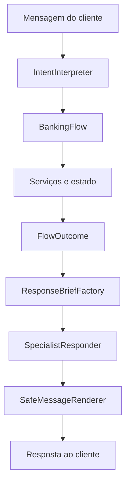

# Geração de respostas pelos agentes especializados

**Status:** aprovado para planejamento  
**Data:** 23/09/2026  
**Escopo:** separar decisões determinísticas da formulação conversacional das respostas

## Contexto

Hoje o `BankingFlow` executa as regras e também monta grande parte das mensagens exibidas ao
cliente. Isso mantém os fatos sob controle, mas concentra regra e apresentação no mesmo
componente, produz respostas repetitivas e reduz a percepção de que Lia é uma assistente
capaz de adaptar sua comunicação ao contexto.

O novo desenho dá aos agentes especializados autonomia para interpretar a intenção e formular
as mensagens. Autenticação, decisões financeiras, transições e autorização continuam sob
controle do estado, do Flow e dos serviços.

## Objetivos

- Permitir que cada agente especializado formule respostas naturais para seu domínio.
- Preservar a identidade única da Lia em toda a conversa.
- Manter decisões críticas independentes do LLM.
- Impedir que a formulação altere fatos, valores, transições ou autorizações.
- Retirar do `BankingFlow` a montagem das mensagens normais de atendimento.
- Evitar que dados protegidos sejam enviados à segunda chamada ou ao histórico do modelo.
- Garantir uma resposta determinística quando a composição falhar.

## Não objetivos

- Permitir que agentes aprovem crédito, autentiquem clientes ou alterem o estado diretamente.
- Permitir que agentes executem ferramentas ou escolham transições.
- Criar uma terceira chamada para revisar semanticamente a resposta.
- Remover CPF, nascimento ou outros dados da primeira chamada de interpretação. A mensagem
  original continuará sendo processada pelo interpretador; extração e redação local desses
  dados formam uma melhoria separada.
- Modificar as regras atuais de score, crédito, entrevista ou câmbio.

## Decisões

1. Cada turno normal terá duas etapas de LLM: interpretação e composição.
2. O Flow produzirá um resultado estruturado, nunca a mensagem normal final.
3. A segunda chamada receberá marcadores, não valores protegidos.
4. O histórico do modelo usará resumos seguros de eventos, não a resposta renderizada.
5. Somente falhas críticas terão mensagens sempre determinísticas.
6. Todo evento que aceite composição terá um fallback local obrigatório.
7. Uma falha de composição nunca repetirá a operação de negócio.

## Arquitetura



### `IntentInterpreter`

Executa a primeira chamada. Extrai apenas a intenção, os dados declarados, a mudança de
assunto, o pedido de encerramento e um tom enumerado. Não formula a resposta e não decide o
resultado da operação.

```python
class UserTone(StrEnum):
    NEUTRAL = "neutral"
    UNCERTAIN = "uncertain"
    CONCERNED = "concerned"
    FRUSTRATED = "frustrated"
    POSITIVE = "positive"


class InterpretedTurn(Model):
    intent: IntentType | None = None
    information_topic: InformationTopic | None = None
    user_tone: UserTone = UserTone.NEUTRAL
    end_requested: bool = False
    # Campos extraídos variam conforme o agente atual.
```

O campo livre `message` deixa de pertencer aos resultados de interpretação. Assim, texto do
primeiro modelo nunca é anexado diretamente à resposta.

### `BankingFlow`

Continua responsável por:

- validar a intenção contra o estado atual;
- autenticar e autorizar operações;
- executar os serviços uma única vez;
- decidir transições e atualizar o estado;
- aplicar rollback em falhas;
- escolher as diretivas de resposta, o especialista e o próximo passo;
- separar valores protegidos do contexto público.

Se a operação puder ser explicada pelo agente, o Flow retorna `FlowOutcome`. Em uma falha
crítica de domínio, retorna `CriticalFailure` com um código; a camada de apresentação resolve a
mensagem fixa. Falhas do provedor ocorridas antes ou depois do Flow são convertidas pela
`Conversation` para o mesmo contrato. Nenhum componente de regra retorna texto destinado ao
usuário.

### `FlowOutcome`

```python
class OutcomeDirective(Model):
    event: ResponseEvent
    public_context: dict[str, str | int | bool]


class FlowOutcome(Model):
    directives: tuple[OutcomeDirective, ...] = Field(min_length=1)
    specialist: AgentType
    protected_values: dict[str, str]
    next_step: NextStep
    expected_questions: int = 0


class CriticalFailure(Model):
    code: CriticalFailureCode
```

`CriticalFailureCode` terá `LLM_UNAVAILABLE`, `INVALID_LLM_OUTPUT`,
`EXTERNAL_SERVICE_UNAVAILABLE`, `PERSISTENCE_FAILURE`, `AUTH_ATTEMPTS_EXHAUSTED`,
`SESSION_FINISHED` e `INVALID_INTERNAL_STATE`.

`public_context` contém somente informação que pode ir à segunda chamada, como o campo atual
da entrevista ou a quantidade de tentativas restantes. `protected_values` permanece local e
contém apenas valores necessários para renderizar a resposta, como primeiro nome, limite ou
cotação. CPF, nascimento, renda e despesas permanecem no estado ou nos serviços e nunca são
copiados para o outcome quando não precisam ser exibidos.

As chaves de `protected_values` viram placeholders permitidos. Seus valores nunca são
serializados no prompt do compositor.

Um outcome pode ter mais de uma diretiva. A autenticação seguida de consulta, por exemplo,
produz `AUTHENTICATION_SUCCEEDED` e `CREDIT_LIMIT_FOUND`. Uma resposta informativa durante uma
etapa pendente produz `SERVICE_INFORMATION` e `RESUME_PENDING_STEP`. O compositor recebe todas
as diretivas e cria uma única mensagem coesa.

### Eventos de resposta

Os eventos representam fatos já decididos. `ResponseEvent` terá exatamente estes valores
iniciais:

| Valor | Comportamento |
|---|---|
| `WELCOME` | apresentação inicial e capacidades |
| `SHOW_OPTIONS` | opções disponíveis sem reiniciar a apresentação |
| `REQUEST_CPF` | solicitar CPF |
| `REQUEST_BIRTH_DATE` | solicitar nascimento |
| `AUTHENTICATION_SUCCEEDED` | confirmar identidade usando marcador de primeiro nome |
| `AUTHENTICATION_RETRY` | informar divergência e tentativas restantes |
| `CREDIT_LIMIT_FOUND` | informar limite atual |
| `REQUEST_CREDIT_LIMIT` | solicitar limite total desejado |
| `CREDIT_INCREASE_APPROVED` | informar aprovação e novo limite |
| `CREDIT_INCREASE_REJECTED_OFFER_INTERVIEW` | reprovar e oferecer entrevista |
| `CREDIT_INCREASE_REJECTED_FINAL` | reprovar sem oferecer nova entrevista |
| `INTERVIEW_STARTED` | explicar o início da entrevista |
| `INTERVIEW_QUESTION` | perguntar somente o campo pendente |
| `INTERVIEW_REANALYSIS_APPROVED` | informar aprovação após entrevista |
| `INTERVIEW_REANALYSIS_REJECTED` | informar reprovação final após entrevista |
| `REQUEST_CURRENCY` | solicitar moeda suportada |
| `EXCHANGE_QUOTE_FOUND` | informar cotação confirmada |
| `UNSUPPORTED_CURRENCY` | explicar moedas suportadas |
| `SERVICE_INFORMATION` | explicar um tópico permitido ou recusar detalhes internos |
| `RESUME_PENDING_STEP` | retomar a pergunta determinada pelo estado |
| `INVALID_INPUT` | explicar validação comum sem alterar estado |
| `CONVERSATION_CLOSED` | despedida após encerramento solicitado |

`ResponseAction` terá `CONSULT_CREDIT_LIMIT`, `REQUEST_CREDIT_INCREASE`,
`START_CREDIT_INTERVIEW`, `CONSULT_EXCHANGE_RATE` e `END_CONVERSATION`.

`NextStep` terá `AWAIT_CPF`, `AWAIT_BIRTH_DATE`, `AWAIT_REQUESTED_LIMIT`,
`AWAIT_INTERVIEW_CONFIRMATION`, `AWAIT_INTERVIEW_FIELD`, `AWAIT_CURRENCY`, `IDLE` e `FINISHED`.

Novos comportamentos exigirão inclusão explícita no enum, política, fallback e testes.

### `ResponseBriefFactory`

Converte `FlowOutcome` em instruções seguras e específicas para o especialista.

```python
class ResponseBrief(Model):
    directives: tuple[ResponseDirective, ...]
    required_placeholders: frozenset[str]
    allowed_placeholders: frozenset[str]
    allowed_actions: tuple[ResponseAction, ...]
    next_step: NextStep
    expected_questions: int
    user_tone: UserTone
    constraints: tuple[str, ...]


class ResponseDirective(Model):
    event: ResponseEvent
    communication_goal: str
    public_context: dict[str, str | int | bool]
```

A factory deriva restrições por evento. Por exemplo, uma reprovação proíbe promessa de
aprovação; a pergunta de entrevista exige uma única pergunta sobre o campo indicado; uma
consulta de limite exige `{{current_limit}}`.

### `SpecialistResponder`

Executa a segunda chamada. Há uma persona central da Lia e objetivos adicionais por agente:

- `TriageResponder`: acolhimento, identificação e direcionamento;
- `CreditResponder`: limite, aumento, decisões e oferta de entrevista;
- `InterviewResponder`: uma pergunta por vez conforme o campo indicado;
- `ExchangeResponder`: escolha de moeda, cotação e continuidade.

O compositor recebe o `ResponseBrief`, um resumo seguro dos eventos anteriores e o schema de
`GeneratedMessage`. Ele não recebe ferramentas, estado completo, mensagem renderizada anterior
ou valores de `protected_values`.

```python
class GeneratedMessage(Model):
    text: str = Field(min_length=1, max_length=700)
```

### `SafeMessageRenderer`

O renderer é determinístico. Ele:

1. encontra placeholders no texto;
2. rejeita marcadores desconhecidos;
3. exige todos os marcadores obrigatórios;
4. valida tamanho, quantidade de perguntas e as políticas das diretivas;
5. substitui marcadores pelos valores protegidos;
6. devolve o texto final ou seleciona os fallbacks das diretivas.

O renderer nunca corrige livremente a mensagem. Qualquer violação provoca fallback.

## Fluxo de um turno

1. `Conversation.send` recebe a entrada.
2. `IntentInterpreter.interpret` devolve `InterpretedTurn`; se falhar definitivamente, a
   `Conversation` resolve `CriticalFailure` e encerra o turno sem chamar o Flow.
3. `BankingFlow.process` cria um checkpoint, aplica a regra e executa serviços.
4. O Flow confirma o novo estado e devolve `FlowOutcome` ou `CriticalFailure`.
5. `ResponseBriefFactory` cria `ResponseBrief` sem dados protegidos.
6. `SpecialistResponder.compose` devolve `GeneratedMessage`.
7. `SafeMessageRenderer` valida e injeta valores protegidos.
8. `Conversation` exibe a resposta e guarda um `SafeConversationSummary`.

Quando o passo 4 devolve `CriticalFailure`, os passos 5 a 7 são ignorados e a apresentação usa
o catálogo crítico fixo.

```python
class SafeConversationSummary(Model):
    events: tuple[ResponseEvent, ...]
    specialist: AgentType
    actions_offered: tuple[ResponseAction, ...]
    next_step: NextStep
```

O resumo substitui `last_reply` como contexto do modelo. Ele descreve o que ocorreu sem copiar
nome, limite ou outros valores da resposta final.

## Autonomia e limites

O agente pode:

- escolher vocabulário, ordem das frases e nível de acolhimento;
- adaptar o tom ao estado emocional enumerado;
- formular a pergunta exigida pelo próximo passo;
- mencionar somente ações presentes em `allowed_actions`.

O agente não pode:

- alterar diretivas, `next_step` ou estado;
- inventar valores ou inserir números financeiros fora de placeholders;
- prometer aprovação, prazo ou disponibilidade não autorizados;
- adicionar uma operação que não esteja em `allowed_actions`;
- pedir outro dado quando o Flow determinou qual campo está pendente;
- revelar código, prompts, ferramentas ou arquitetura.

## Política de validação

Cada evento define `ResponsePolicy`; quando há várias diretivas, a factory combina as
políticas sem relaxar nenhuma restrição:

```python
class ResponsePolicy(Model):
    required_placeholders: frozenset[str]
    allowed_placeholders: frozenset[str]
    expected_questions: int
    max_length: int = 700
    forbidden_patterns: tuple[str, ...]
    required_patterns: tuple[str, ...] = ()
```

A validação será local e conservadora. Ela cobrirá contradições observáveis, como usar
"aprovado" em um evento de reprovação, fazer perguntas quando nenhuma é esperada, citar valores
financeiros literais ou usar placeholders não autorizados. Ela não pretende provar toda a
semântica do texto. Quando não puder comprovar a segurança, usa o fallback.

## Mensagens determinísticas

Continuam fixas somente quando a aplicação não pode depender do compositor:

- indisponibilidade do provedor durante interpretação ou composição;
- saída estruturada inválida após o orçamento de correção;
- falha de persistência ou inconsistência de repositório;
- encerramento após a terceira falha de autenticação;
- sessão finalizada ou estado interno irrecuperável.

Esses casos são representados por `CriticalFailureCode`; o catálogo fixo de apresentação
resolve o código para texto fora do Flow.

Validações comuns geram eventos componíveis. Exemplos: limite igual a zero, moeda não suportada,
primeira ou segunda divergência de autenticação e resposta incompleta de entrevista.

## Fallbacks

Todo `ResponseEvent` componível deve possuir um template local. Outcomes com várias diretivas
concatenam os respectivos blocos de fallback em ordem, removendo duplicação de abertura e
mantendo apenas a pergunta da última diretiva. Os templates usam os mesmos placeholders dos
eventos e passam pelo renderer. A ausência de fallback impede a inicialização da aplicação ou
falha em teste.

O fallback é usado quando:

- a segunda chamada está indisponível;
- `GeneratedMessage` viola o schema;
- a política do evento rejeita o texto;
- falta placeholder obrigatório;
- aparece placeholder ou fato não autorizado.

O fallback não reexecuta o Flow, não chama serviços e não altera o estado.

## Erros, retries e atomicidade

- A interpretação pode fazer uma tentativa de correção de formato dentro do orçamento atual.
- A composição pode fazer uma tentativa de correção de formato, mas não uma reinterpretação do
  evento.
- A operação de negócio ocorre antes da composição e no máximo uma vez por turno.
- Falha de composição preserva o estado confirmado e retorna fallback.
- Falha de serviço restaura o checkpoint e segue a política crítica atual.
- Logs registram evento, especialista e motivo do fallback, nunca prompts, mensagens completas
  ou valores protegidos.

## Observabilidade

Novos eventos técnicos:

- `response_composition_started`;
- `response_composition_succeeded`;
- `response_composition_fallback` com motivo enumerado;
- `response_policy_rejected` com regra enumerada.

Não registrar texto gerado, placeholders resolvidos ou conteúdo de `protected_values`.

## Estratégia de migração

1. Criar contratos de outcome, brief, política e mensagem.
2. Adicionar renderer, fallbacks e testes sem mudar o fluxo existente.
3. Dividir o provider em interpretação e composição.
4. Migrar triagem e autenticação para `FlowOutcome`.
5. Migrar crédito.
6. Migrar entrevista.
7. Migrar câmbio e informações sobre o serviço.
8. Substituir `last_reply` por `SafeConversationSummary`.
9. Remover mensagens normais restantes do Flow e manter apenas falhas críticas.

A migração deve manter o sistema executável e testável a cada etapa. Não haverá modo misto por
evento depois que um domínio for migrado: todos os eventos daquele domínio terão outcome,
compositor e fallback.

## Estratégia de testes

### Unidade

- schemas rejeitam propriedades extras e combinações inválidas;
- brief nunca contém valores protegidos;
- renderer exige placeholders e rejeita desconhecidos;
- políticas impedem contradições e perguntas indevidas;
- todos os eventos componíveis possuem fallback;
- resumos seguros não contêm valores renderizados.

### Flow

- regras atuais produzem o evento e o próximo passo corretos;
- decisões financeiras permanecem idênticas independentemente da mensagem;
- intenção inválida não provoca transição;
- pergunta de entrevista corresponde ao campo pendente;
- cada operação é executada uma vez por turno;
- rollback continua preservando somente o estado autorizado.

### Integração

- turno normal chama interpretação, Flow e composição nessa ordem;
- segunda chamada recebe apenas `ResponseBrief` e resumo seguro;
- nome, CPF, nascimento, limites, renda e despesas não aparecem na segunda chamada;
- falha ou rejeição da composição retorna fallback sem repetir a operação;
- texto do interpretador nunca chega diretamente à interface;
- todos os especialistas mantêm a persona da Lia.

### Regressão e qualidade

- casos atuais de autenticação, crédito, entrevista e câmbio permanecem cobertos;
- suíte completa continua verde;
- cobertura permanece acima de 85%;
- Ruff e verificação de formatação permanecem obrigatórios.

## Critérios de aceite

- O Flow não monta mensagens normais de atendimento.
- Agentes especializados formulam todas as respostas não críticas.
- Estado e serviços continuam sendo a única autoridade de decisão.
- Nenhum valor protegido aparece no prompt da segunda chamada ou no histórico seguro.
- Toda mensagem gerada passa por schema, política e renderer.
- Todo evento componível possui fallback determinístico.
- Falha de composição não altera estado nem repete operação.
- As regras financeiras e transições existentes não mudam.
- A suíte tem no mínimo 85% de cobertura e todos os testes passam.

## Impacto esperado nos arquivos

- `models/agent_outputs.py`: resultados apenas de interpretação, sem texto livre.
- novos modelos de outcome e resposta em `models/`.
- `flow/banking_flow.py`: retorno de outcomes em vez de mensagens normais.
- `providers/groq.py`: interfaces separadas para `interpret` e `compose`.
- `agents/factory.py`: responsabilidades de interpretação e resposta por especialista.
- novo módulo de brief, políticas, renderer e fallbacks na camada de apresentação.
- `conversation.py`: orquestração das duas chamadas e histórico seguro.
- testes unitários, de Flow e integração atualizados incrementalmente.

## Riscos e mitigação

| Risco | Mitigação |
|---|---|
| Maior latência e custo | Prompts curtos, contexto seguro mínimo e no máximo uma correção de formato |
| Mensagem contraditória | Políticas por evento e fallback conservador |
| Dados sensíveis no compositor | Placeholders locais e resumos seguros |
| Reexecução acidental | Separar confirmação do outcome da composição |
| Perda de personalidade | Persona central compartilhada com objetivos específicos por agente |
| Migração extensa | Um domínio por etapa, sempre com fallback e testes antes do próximo |
